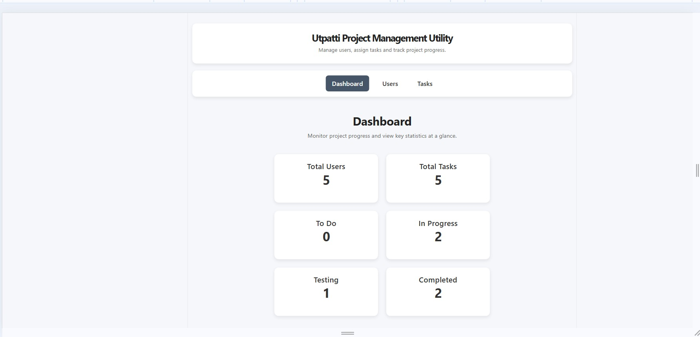
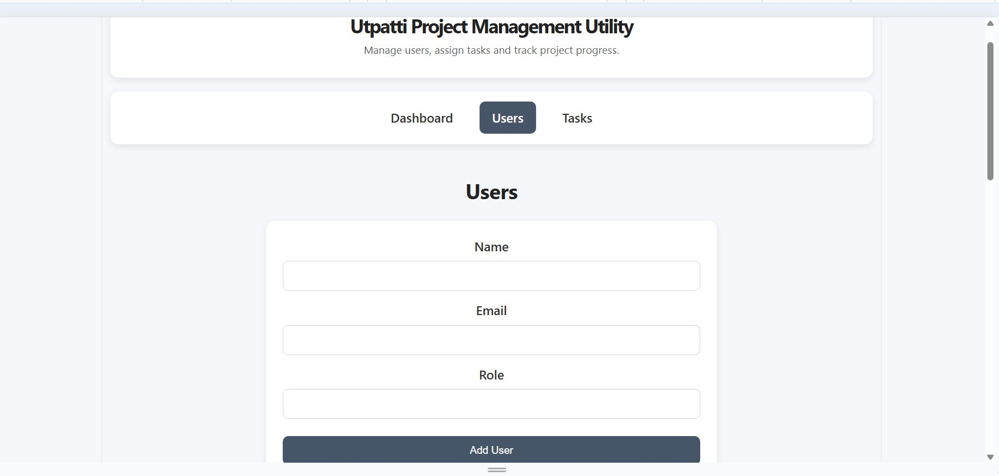
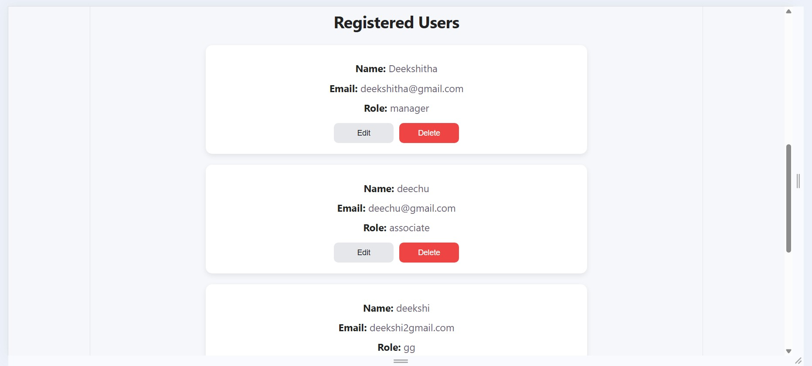
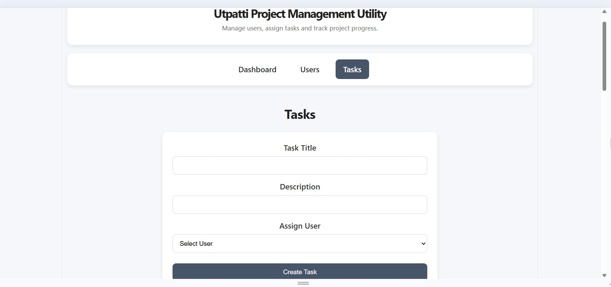
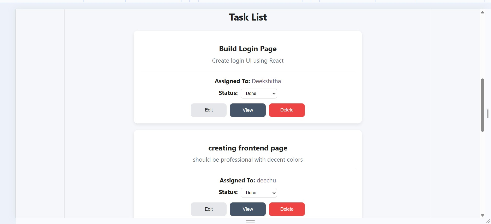
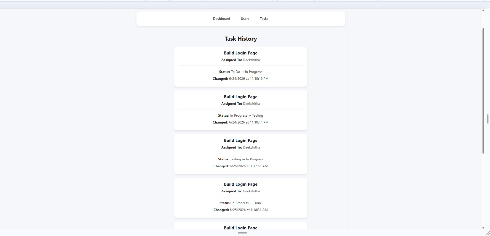

# Utpatti - Project Management Utility

A full-stack **Project Management Utility** built using the **MERN Stack** to manage users, tasks, and track task status history throughout the Software Development Life Cycle (SDLC).

This project was developed as part of the **Mittarv Technologies Internship Assignment**.

---

# Live Demo

**Frontend (Vercel)**
https://utpatti-project-management-utility.vercel.app

**Backend (Render)**
https://utpatti-project-management-utility-1.onrender.com

---

# GitHub Repository

https://github.com/deekshithaanyaboina22-alt/utpatti-project-management-utility

---

# Features

### User Management

* Register new users
* View all registered users
* Update user details
* Delete users

### Task Management

* Create tasks
* Assign tasks to users
* Update task details
* Delete tasks
* Track task status through different SDLC phases:

  * To Do
  * In Progress
  * Testing
  * Done

### Task History

* View the complete status history of any task.
* Displays previous status, new status, assigned user, and timestamp.
* Accessible directly from the corresponding task.

---

# Technology Stack

## Frontend

* React
* React Router DOM
* Axios
* CSS

## Backend

* Node.js
* Express.js

## Database

* MongoDB Atlas
* Mongoose

## Deployment

* Vercel
* Render

---

# Project Structure

```
utpatti-project
│
├── backend
│   ├── config
│   ├── controllers
│   ├── models
│   ├── routes
│   └── server.js
│
├── frontend
│   └── vite-project
│       ├── public
│       ├── src
│       └── package.json
│
└── README.md
```

---

# Screenshots

## Dashboard



---

## User Registration



---

## Registered Users



---

## Task Form



---

## Task List



---

## Task History



---

# Installation

## Clone the repository

```bash
git clone https://github.com/deekshithaanyaboina22-alt/utpatti-project-management-utility.git
```

## Backend Setup

```bash
cd backend
npm install
```

Create a `.env` file:

```
MONGO_URI=your_mongodb_connection_string
PORT=5000
```

Start the backend:

```bash
npm start
```

---

## Frontend Setup

```bash
cd frontend/vite-project
npm install
npm run dev
```

---

# API Endpoints

## Users

* GET /users
* POST /users
* PUT /users/:id
* DELETE /users/:id

## Tasks

* GET /tasks
* POST /tasks
* PUT /tasks/:id
* DELETE /tasks/:id
* GET /tasks/:id/history

---

# Design Choices

* Implemented a modular folder structure separating controllers, routes, models, and configuration.
* Used RESTful APIs for clear communication between frontend and backend.
* React components are organized by pages for better maintainability.
* MongoDB Atlas stores user and task information.
* Task history is maintained whenever a task status changes, allowing users to review the complete lifecycle of each task.
* React Router is used for client-side navigation with support for page refresh after deployment.

---

# Future Improvements

Given more time, the following enhancements could be added:

* User authentication using JWT.
* Role-based access (Admin/User).
* Task filtering and searching.
* Due dates and task priorities.
* File attachments.
* Notifications.
* Dashboard analytics and charts.
* Pagination for users and tasks.
* Unit and integration testing.

---

# Author

**Deekshitha Anyaboina**

GitHub: https://github.com/deekshithaanyaboina22-alt
